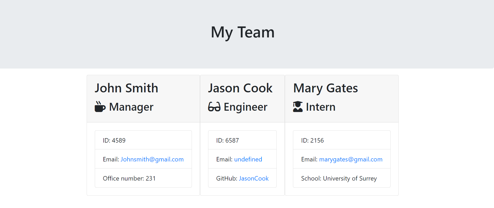

# MyTeamMates-Generator

Team Profile Generator

## Link of HTML sample generated by the application

http://127.0.0.1:5500/team.html

## Contents

- [Description](#description)
- [Screenshots](#screenshots)
- [Authors](#authors)
- [License](#license)

## Description

## Screenshots

## Authors

- [Eleftheria Elle Ntispyraki](https://github.com/EleNtis)

## License

Please refer to the LICENSE in the repo.
